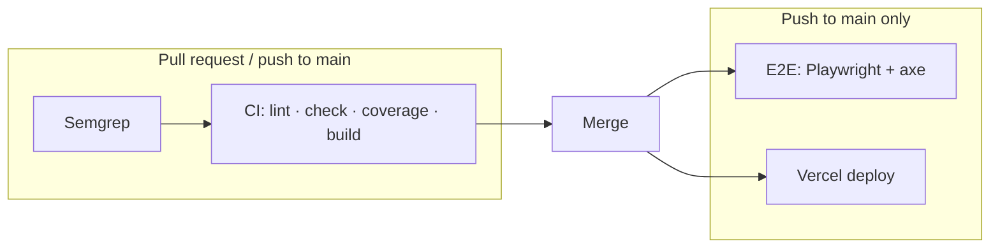

# CI/CD Architecture

Implements **AI Engineering Blueprint §3** for `profile-page`. Reusable workflow logic lives in [aaron-howard/ci-templates](https://github.com/aaron-howard/ci-templates) (pinned at **`v1.0.0`**).

## Pipeline overview



| Stage   | When            | Where                        | What runs                                                  |
| ------- | --------------- | ---------------------------- | ---------------------------------------------------------- |
| Semgrep | PR + `main`     | `ci-templates` `semgrep.yml` | Registry packs + shared `rules/` + `config/semgrep/rules/` |
| CI gate | PR + `main`     | `ci-templates` `ci.yml`      | `npm audit`, lint, `svelte-check`, coverage, build         |
| E2E     | `main` + manual | `ci-templates` `e2e.yml`     | Playwright smoke, axe, honeypot                            |
| Deploy  | `main`          | Vercel (git integration)     | Production preview + promote — not a GitHub Actions job    |

## Repo layout

```
profile-page/
  .github/
    dependabot.yml          # npm + github-actions (weekly)
    workflows/
      ci.yml                # thin wrapper → ci-templates@v1.0.0
      e2e.yml               # thin wrapper → ci-templates@v1.0.0
```

**Do not** put `dependabot.yml` under `workflows/` — GitHub expects it at `.github/dependabot.yml`.

## Thin wrapper pattern

This repo only defines **triggers**, **concurrency**, and **permissions**. Steps live in `ci-templates`:

```yaml
uses: aaron-howard/ci-templates/.github/workflows/ci.yml@v1.0.0
```

Bump the tag when upgrading templates (see [ci-templates CHANGELOG](https://github.com/aaron-howard/ci-templates/blob/main/CHANGELOG.md)).

## Local parity

```bash
npm run lint
npm run check
npm run test:coverage
npm run build
npm run semgrep:scan    # optional SAST before push
npm run test:e2e        # needs Postgres + exported .env (see AGENTS.md)
```

Husky runs lint-staged on commit and `check` + unit tests on push.

## Secrets

| Secret         | Used by                 | Required                                                    |
| -------------- | ----------------------- | ----------------------------------------------------------- |
| `DATABASE_URL` | E2E workflow (optional) | No — loaders degrade gracefully; set for full DB-backed E2E |
| Vercel tokens  | Vercel Git integration  | Managed in Vercel dashboard                                 |

## Manual runs

- **CI:** Actions → CI → Run workflow (`workflow_dispatch` on PR branches via branch selector)
- **E2E:** Actions → E2E → Run workflow

## Rolling out to another repo

1. Copy `.github/workflows/ci.yml` and `e2e.yml` (adjust if private repo — see ci-templates README visibility rules).
2. Add `.github/dependabot.yml` and `renovate.json`; install the [Renovate app](https://github.com/apps/renovate).
3. Add `config/semgrep/rules/` for stack-specific Semgrep rules (optional).
4. Ensure `package.json` has `lint`, `check`, `test:coverage`, `build` scripts (CI contract).

## Debugging failures

| Failure                  | Likely fix                                           |
| ------------------------ | ---------------------------------------------------- |
| `workflow was not found` | `ci-templates` visibility / pin tag exists           |
| Semgrep                  | Fix rule violation or adjust `config/semgrep/rules/` |
| `npm audit`              | Override or upgrade vulnerable dep                   |
| Coverage / test          | Fix tests locally with `npm run test:coverage`       |
| E2E axe                  | A11y contrast/content issue on rendered page         |

See [AI-WORKFLOW-PLAYBOOK.md](./AI-WORKFLOW-PLAYBOOK.md) for Cursor vs Claude handoffs.

## Related

- [ci-templates v1.0.0 release](https://github.com/aaron-howard/ci-templates/releases/tag/v1.0.0)
- [BLUEPRINT-STATUS.md](./BLUEPRINT-STATUS.md)
