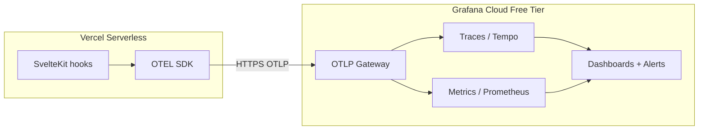

# Observability (OpenTelemetry + Grafana Cloud)

Implements **AI Engineering Blueprint §5** for `profile-page`.

## Architecture



| Signal  | Source                                 | Grafana             |
| ------- | -------------------------------------- | ------------------- |
| Traces  | Route spans, Prisma, email sends       | Explore → Tempo     |
| Metrics | Custom counters + auto-instrumentation | Dashboards / alerts |
| Logs    | Vercel function logs (not OTLP yet)    | Vercel dashboard    |

## Code layout

```
config/otel/              SDK init, OTLP exporters
config/grafana/           Importable dashboard + alert recipes
src/lib/observability/    tracer, metrics, app counters, flush
src/hooks.server.ts       Per-route spans + HTTP metrics
src/lib/server/db/        Prisma query spans
src/lib/server/email.ts   email.send spans
```

### Custom metrics

| Metric                    | Labels                                        | When                                            |
| ------------------------- | --------------------------------------------- | ----------------------------------------------- |
| `app.http.requests`       | `http.method`, `route.id`, `http.status_code` | Every request                                   |
| `app.http.errors`         | `route.id`, `source`                          | HTTP 5xx or `handleError`                       |
| `app.rate_limit.exceeded` | `route.id`                                    | Contact form 429                                |
| `app.contact.submissions` | `outcome`                                     | `success`, `validation_error`, `delivery_error` |

## 1. Grafana Cloud setup (one-time)

1. Create a free stack at [grafana.com](https://grafana.com/) → **My Account** → **Cloud Portal**
2. Open your stack → **Configure OpenTelemetry** (or **Connections** → **OpenTelemetry (OTLP)**)
3. Copy the **OTLP gateway** host (e.g. `otlp-gateway-prod-us-east-3.grafana.net`) — **not** the stack UI hostname
4. Create an **Access Policy** token with `traces:write` and `metrics:write`
5. Build the Basic auth header: `base64(instanceId:token)` → `Authorization=Basic <value>`

## 2. Local verification

Add to `.env.local` (never commit):

```env
OTEL_EXPORTER_OTLP_TRACES_ENDPOINT="https://otlp-gateway-prod-us-east-3.grafana.net/otlp/v1/traces"
OTEL_EXPORTER_OTLP_TRACES_HEADERS="Authorization=Basic <base64-user:token>"
OTEL_EXPORTER_OTLP_METRICS_ENDPOINT="https://otlp-gateway-prod-us-east-3.grafana.net/otlp/v1/metrics"
OTEL_EXPORTER_OTLP_METRICS_HEADERS="Authorization=Basic <base64-user:token>"
```

Export env for `vite dev` (see `AGENTS.md`), then:

```bash
npm run otel:verify
npm run dev
```

Browse the site, then check **Grafana → Explore → Tempo** for `profile-page` traces.

## 3. Production (Vercel)

In **Vercel → Project → Settings → Environment Variables**, add the same four `OTEL_EXPORTER_OTLP_*` variables for **Production** (and Preview if desired).

| Variable                              | Notes                                          |
| ------------------------------------- | ---------------------------------------------- |
| `OTEL_EXPORTER_OTLP_TRACES_ENDPOINT`  | `.../otlp/v1/traces`                           |
| `OTEL_EXPORTER_OTLP_TRACES_HEADERS`   | `Authorization=Basic ...` — mark **Sensitive** |
| `OTEL_EXPORTER_OTLP_METRICS_ENDPOINT` | `.../otlp/v1/metrics`                          |
| `OTEL_EXPORTER_OTLP_METRICS_HEADERS`  | Same token as traces                           |

Redeploy after saving. Resource attributes include `deployment.environment` from `VERCEL_ENV` and `service.version` from the git SHA.

OTLP is **opt-in**: if endpoints are unset, the SDK does not start and the app behaves as before.

## 4. Dashboards

Import `config/grafana/dashboard-profile-page.json` — see [config/grafana/README.md](../config/grafana/README.md).

Panels cover HTTP rate, errors, contact form outcomes, rate limits, and a Tempo trace browser.

## 5. Alerts

Alert rule recipes (Prometheus queries) are in [config/grafana/README.md](../config/grafana/README.md). Create contact points in Grafana for email/Slack/PagerDuty.

## 6. AI workflow

```text
Claude  → Design spans/metrics or alert thresholds; draft dashboard panel queries.
Cursor  → Implement in src/lib/observability/ and hooks; run npm run otel:verify.
```

See [AI-WORKFLOW-PLAYBOOK.md](./AI-WORKFLOW-PLAYBOOK.md) §4.

## Troubleshooting

| Symptom               | Check                                                                               |
| --------------------- | ----------------------------------------------------------------------------------- |
| `otel:verify` 401/403 | Token scopes; Basic header encoding                                                 |
| No traces in Grafana  | Vercel env vars on Production; redeploy; gateway region URL                         |
| No metrics            | Both metrics endpoint **and** headers set; wait one export interval (~5s on Vercel) |
| High cardinality      | Avoid unbounded labels — route IDs are SvelteKit route templates, not raw URLs      |

## Related

- `.env.example` — OTLP variable template
- [DEPLOYMENT_GUIDE.md](../DEPLOYMENT_GUIDE.md) — Vercel deployment
- [BLUEPRINT-STATUS.md](./BLUEPRINT-STATUS.md)
